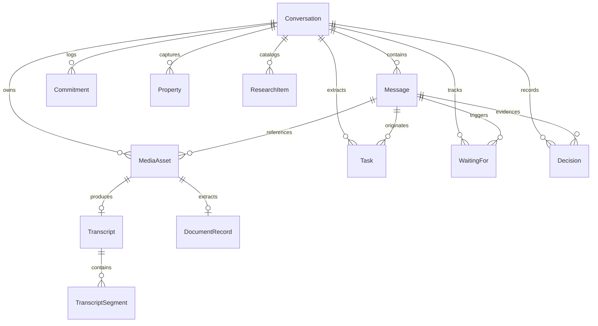

# OWI Knowledge Model & Database Schema

The OWI database is structured in SQLite with Write-Ahead Logging (`PRAGMA journal_mode=WAL`) and full foreign key enforcement (`PRAGMA foreign_keys=ON`).

---

## 1. Entity-Relationship Diagram

---

## 2. Table Specifications

### `conversations`
- `id` (INTEGER, PK): Unique conversation identifier.
- `title` (VARCHAR(255)): Human-readable title or WhatsApp chat name.
- `source_type` (VARCHAR(50)): `export_txt`, `export_zip`, `drag_drop`, `folder_watch`, `companion`.
- `source_hash` (VARCHAR(64)): SHA-256 fingerprint for deduplication.
- `start_date`, `end_date` (DATETIME): Timeline range of messages.
- `message_count` (INTEGER): Total messages.
- `summary`, `detailed_summary` (TEXT): AI generated executive summaries.

### `messages`
- `id` (INTEGER, PK): Unique message identifier.
- `conversation_id` (INTEGER, FK -> conversations.id).
- `sender_name` (VARCHAR(255)): Name of the author.
- `timestamp` (DATETIME): Normalized UTC message time.
- `content` (TEXT): Cleaned message text.
- `message_type` (VARCHAR(50)): `text`, `voice`, `image`, `video`, `document`, `system`.
- `has_attachment` (BOOLEAN): Attachment presence indicator.
- `attachment_name` (VARCHAR(255)): Original attachment filename.
- `source_index` (INTEGER): Line or sequence order from raw export.

### `media_assets`
- `id` (INTEGER, PK): Asset identifier.
- `conversation_id`, `message_id` (INTEGER, FKs).
- `file_name` (VARCHAR(255)): Sanitized filename.
- `file_type` (VARCHAR(50)): `audio`, `image`, `video`, `document`.
- `file_size` (INTEGER): File size in bytes.
- `file_path` (VARCHAR(500)): Local filesystem path.
- `sha256_hash` (VARCHAR(64)): Checksum for deduplication.
- `duration_seconds` (FLOAT): Duration for audio/video.
- `width`, `height` (INTEGER): Dimensions for images/video.

### `transcripts` & `transcript_segments`
- `transcripts`: Links 1:1 to `media_assets`, stores `language_detected`, `confidence`, `full_text`, `model_used`.
- `transcript_segments`: Links 1:N to `transcripts`, stores `start_time`, `end_time`, `text`, `speaker` for real-time audio scrubbing.

### `tasks`
- `id` (INTEGER, PK)
- `conversation_id`, `message_id` (FKs)
- `title` (VARCHAR(255)): Action item summary.
- `status` (VARCHAR(20)): `inbox`, `open`, `waiting`, `completed`, `dismissed`.
- `priority` (VARCHAR(20)): `low`, `medium`, `high`.
- `confidence` (FLOAT): Confidence score (0.0 - 1.0).
- `due_date` (DATETIME): Resolved deadline anchored to message date.
- `assigned_contact_name` (VARCHAR(255)): Assignee.
- `source_excerpt` (TEXT): Verifiable context excerpt.

### `properties` (Stone Mode)
- `id` (INTEGER, PK)
- `conversation_id` (FK)
- `title` (VARCHAR(255)): Listing heading.
- `property_type`: Office, apartment, villa, commercial.
- `area_sqm`: Square meters.
- `price`, `currency`, `deal_type`: Price in EGP/USD, sale vs rent.
- `finishing`: Core & Shell, Semi-Finished, Ultra Lux.
- `has_admin_license`: Administrative license boolean.
- `listing_draft`: Generated marketing listing draft.
- `source_evidence`: Exact messages citing these parameters.

### `jobs`
- `id` (INTEGER, PK): Background asynchronous task identifier.
- `job_type` (VARCHAR(50)): `transcription`, `ocr`, `import`, `nlp`, `video`.
- `status` (VARCHAR(20)): `queued`, `processing`, `completed`, `failed`, `cancelled`.
- `progress` (INTEGER): Progress indicator (0–100%).
- `attempts` (INTEGER): Worker attempt counter.
- `lease_expires_at` (DATETIME): Active worker lease expiration timestamp for crash recovery.
- `error_message` (TEXT): Failure diagnostics.
- `payload`, `result` (JSON): Input arguments and output result data.

### `messages_fts` (Virtual FTS5 Index)
Full-text search virtual table indexed with `tokenize='unicode61 remove_diacritics 2'` for rapid BM25 text search across Arabic and English.

